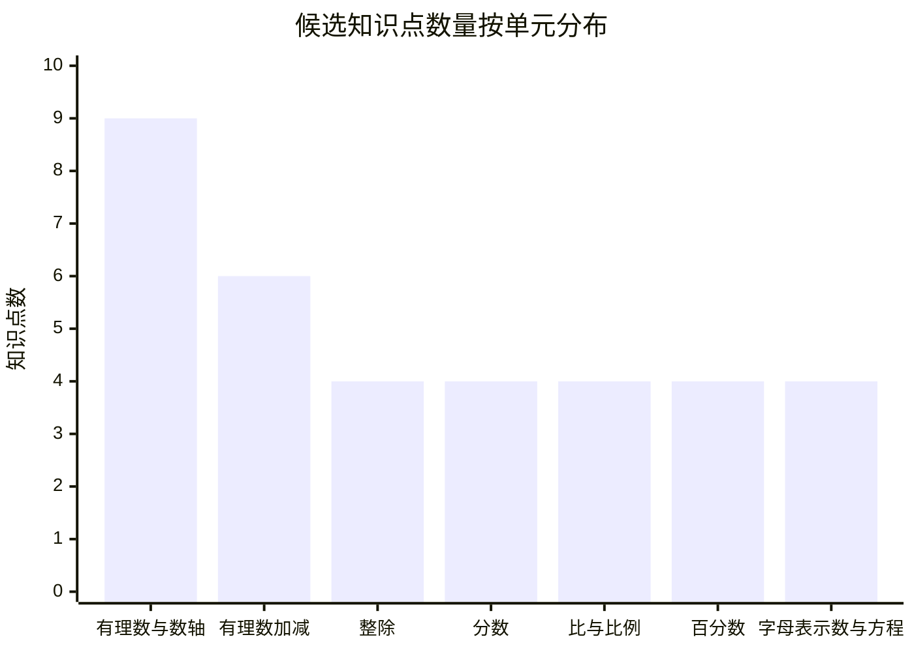
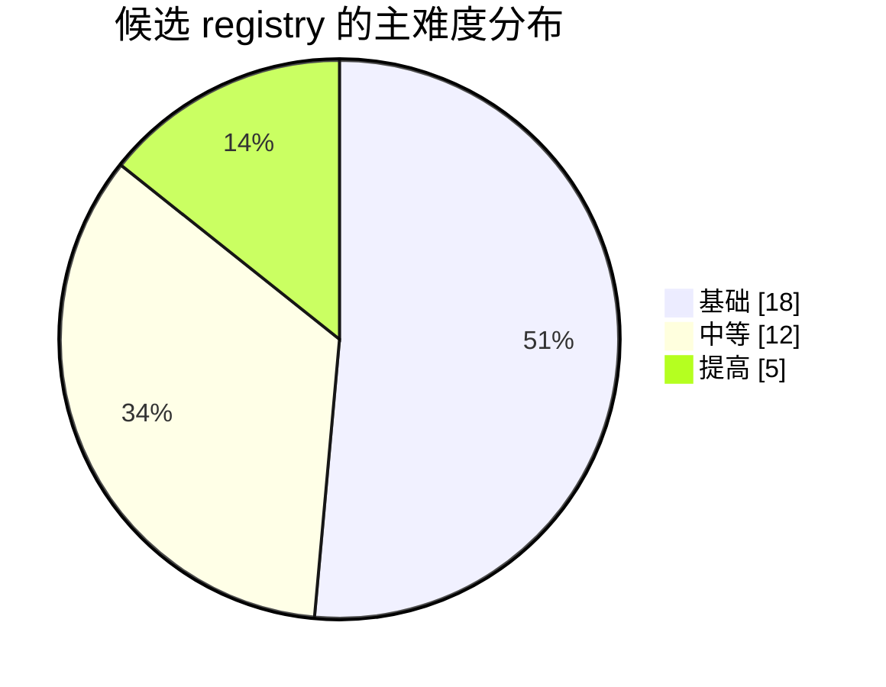

# 沪教版六年级上数学知识点体系深度研究报告

## 执行摘要

本报告将“六年级上（沪教版、cn_k12_2022）数学知识点体系”的对象，严格限定为**用户给出的 YAML 候选 registry**，并按上传提示文件要求，从“可批改、可归因、可统计、可专项训练”的微知识点视角做结构审计、教学审计与训练审计。2022 年版义务教育课程方案与课程标准自 2022 年秋季学期起执行；在公开可检索材料中，数学学科在九年义务教育总课时中占比约为 13%—15%，小学阶段核心素养强调数感、量感、符号意识、运算能力、模型意识、应用意识等，因此一个好的六上 registry 不能只罗列章节名，而必须把“概念—表征—规则—应用—诊断标签”串成可落地训练链。fileciteturn0file0 citeturn29view0turn27search0

总判断很明确：这份候选 registry 的**主干是对的**，尤其是“有理数与数轴 → 有理数加减 → 比例与百分数 → 字母表示数与一步方程”的递进链条，符合从算术向代数过渡的基本逻辑；但它的**粒度并不均匀**。最明显的问题有三类：第一，`fraction_add_subtract`、`fraction_multiply_divide`、`percentage_word_problem_model`、`one_step_equation_solving` 这类点过粗，会直接削弱错因归因的精度；第二，`distance`、`midpoint`、`absolute_value_with_condition` 这类点又拆得偏细，若题量不足，后续统计会稀疏；第三，`active` 现在更像布尔值，实际更适合改为“核心活跃/复习活跃/引入活跃/保留未激活”的分层状态。fileciteturn0file0

如果只看当前 YAML 片段，候选体系一共 35 个 knowledge_point，其中有理数及其加减相关点 15 个，占 42.9%，说明设计者把“带符号数的理解与运算稳定化”放在了绝对核心位置；这在教学上是合理的，因为六年级上若这里不稳，后面的比例、百分数和方程都会变成机械套题。真正需要补刀的不是“再加更多内容”，而是**让粗点拆开、让错标签固定、让训练路径更像一条可执行流水线**。这一判断与 2022 课标对运算能力、模型意识和应用意识的强调是一致的。citeturn27search0turn29view0

同时也必须说清限制：本次公开检索能够较稳妥确认的是**课程标准层面的要求、实施时间、五四学制课程开设信息**；但未能在可访问的公开资源中拿到**沪教版六上数学官方目录页或教参全文**。因此，关于“分数与比例在六上到底占多大比重”“本册是否完整覆盖一元一次方程”的判断，只能给出**基于 registry 内部结构 + 课程标准导向**的中等置信建议，而不能伪装成页码级教材核验结论。citeturn31view0turn27search0turn32search3

## 研究依据与方法

本报告依据有三层。第一层，是用户对输出形态的硬性要求：必须有执行摘要、覆盖矩阵、逐知识点分析、错误模式扩展、分知识点题单、训练路径、命名与粒度建议；若题库来源未指定，则可采用公开中小学题型与沪教版配套练习的通用题型框架进行改编。第二层，是上方 YAML 候选 registry 片段本身，它决定了本报告的审计对象不是“抽象教材”，而是一个**待投入数据库/题库/诊断系统**的知识点注册表。第三层，是 2022 版义务教育数学课程的公开可检索共识信息：2022 年秋季开始执行，数学强调从数感、量感、符号意识、运算能力到模型与应用的渐进发展。fileciteturn0file0 citeturn29view0turn27search0

方法上，我采用四步并行。先做**结构审计**：看知识点拆分是否均匀、是否能承接题目与错因标签。再做**教学审计**：看每个 point 是否有清晰定义、微技能、先修与后续。接着做**诊断审计**：看是否能稳定落到典型错误标签与纠正训练。最后做**训练审计**：给出按 knowledge_point 分组的题单与路径，检验这套 registry 是否真的能驱动“教—练—测—评—补”。这套方法比“列知识清单”更狠，因为它把每个点都当成一个未来要落地的数据节点来处理。fileciteturn0file0

就学段定位而言，本报告把“六上”按**五四学制的衔接年**来理解：公开可检索的五四学制课程序列中，数学在 6—9 年级连续开设，而当前 YAML 中出现的有理数、数轴、绝对值、比例、百分数、字母表示数与一步方程，也确实呈现出明显的“初中起始代数化”风格。也就是说，这不是普通小学六上那种纯算术继续，而是一个**从小学算术向初中代数与模型思维过渡**的版本。citeturn32search3turn27search0

## 知识点覆盖矩阵与结构判断

按上方 YAML 片段统计，候选 registry 共 35 个知识点，单元分布为：有理数与数轴 9 个、有理数加减 6 个，其余“整除”“分数复习提升”“比与比例初步”“百分数”“字母表示数与简单方程”各 4 个。主难度分布可归并为基础 18 个、中等 12 个、提高 5 个。这个内部结构说明设计者已经意识到：六上最该先打穿的，不是“应用题花样”，而是**带符号数的表征与运算稳定性**。这与课程标准中对运算能力、符号意识和应用意识的要求方向并不冲突。citeturn27search0turn29view0

| 单元 | 知识点 | 主难度 | 诊断价值 | 训练价值 | 活跃状态 |
|---|---|---:|---:|---:|---|
| 有理数与数轴 | rational_number_concept 有理数的概念与分类 | 基础 | 高 | 中 | 核心活跃 |
| 有理数与数轴 | positive_negative_number_meaning 正数负数零的意义 | 基础 | 中 | 中 | 核心活跃 |
| 有理数与数轴 | number_line_representation 数轴表示 | 基础 | 高 | 高 | 核心活跃 |
| 有理数与数轴 | order_comparison_on_number_line 数轴顺序比较 | 基础 | 高 | 高 | 核心活跃 |
| 有理数与数轴 | distance_on_number_line 数轴距离 | 中等 | 高 | 高 | 核心活跃 |
| 有理数与数轴 | midpoint_on_number_line 数轴中点 | 中等 | 中 | 中 | 核心活跃 |
| 有理数与数轴 | opposite_number_definition 相反数定义 | 基础 | 高 | 中 | 核心活跃 |
| 有理数与数轴 | absolute_value_basic 绝对值基础 | 基础 | 高 | 高 | 核心活跃 |
| 有理数与数轴 | absolute_value_with_condition 含条件的绝对值 | 提高 | 高 | 高 | 核心活跃 |
| 有理数加减 | rational_add_same_sign 同号相加 | 基础 | 中 | 高 | 核心活跃 |
| 有理数加减 | rational_add_different_sign 异号相加 | 中等 | 高 | 高 | 核心活跃 |
| 有理数加减 | rational_subtract_as_add_opposite 减法转化为加相反数 | 中等 | 高 | 高 | 核心活跃 |
| 有理数加减 | rational_mixed_operations 有理数加减混合运算 | 中等 | 高 | 高 | 核心活跃 |
| 有理数加减 | remove_brackets_with_sign 去括号与符号 | 提高 | 高 | 高 | 核心活跃 |
| 有理数加减 | absolute_value_in_operations 绝对值参与运算 | 提高 | 中 | 高 | 核心活跃 |
| 整除与因数倍数 | factor_multiple_concept 因数倍数概念 | 基础 | 中 | 中 | 核心活跃 |
| 整除与因数倍数 | prime_composite_identification 质数合数判断 | 基础 | 中 | 中 | 核心活跃 |
| 整除与因数倍数 | common_factor_gcd 最大公因数 | 中等 | 中 | 中 | 核心活跃 |
| 整除与因数倍数 | common_multiple_lcm 最小公倍数 | 中等 | 中 | 中 | 核心活跃 |
| 分数复习提升 | fraction_simplification 分数约分 | 基础 | 中 | 高 | 复习活跃 |
| 分数复习提升 | fraction_comparison 分数比较 | 基础 | 中 | 高 | 复习活跃 |
| 分数复习提升 | fraction_add_subtract 分数加减 | 中等 | 中 | 高 | 复习活跃 |
| 分数复习提升 | fraction_multiply_divide 分数乘除 | 中等 | 中 | 高 | 复习活跃 |
| 比与比例初步 | ratio_concept 比的意义 | 基础 | 高 | 中 | 核心活跃 |
| 比与比例初步 | ratio_simplification 比的化简 | 基础 | 中 | 中 | 核心活跃 |
| 比与比例初步 | proportion_definition 比例定义 | 中等 | 中 | 中 | 核心活跃 |
| 比与比例初步 | proportion_cross_multiplication 比例性质 | 提高 | 高 | 高 | 核心活跃 |
| 百分数 | percentage_meaning 百分数意义 | 基础 | 中 | 中 | 核心活跃 |
| 百分数 | percentage_fraction_decimal_conversion 百分数分数小数互化 | 基础 | 中 | 高 | 核心活跃 |
| 百分数 | percentage_increase_decrease 百分数增减 | 提高 | 高 | 高 | 核心活跃 |
| 百分数 | percentage_word_problem_model 百分数应用模型 | 中等 | 高 | 高 | 核心活跃 |
| 字母表示数与简单方程 | algebraic_expression_meaning 代数式意义 | 基础 | 高 | 中 | 引入活跃 |
| 字母表示数与简单方程 | substitute_value_evaluation 代入求值 | 基础 | 中 | 中 | 引入活跃 |
| 字母表示数与简单方程 | equation_concept 方程概念 | 基础 | 中 | 中 | 引入活跃 |
| 字母表示数与简单方程 | one_step_equation_solving 一步方程求解 | 中等 | 高 | 高 | 引入活跃 |

从这个矩阵能直接看出两点。第一，**诊断价值高**的点，集中在“数轴表征、绝对值、异号相加、减法转化、去括号、比例性质、百分数增减、百分数应用、一歩方程”这九类，因为这些地方最容易产生可稳定标注的错因。第二，**训练价值高但点位过粗**的地方，恰恰是“分数加减、分数乘除、百分数应用模型、一步方程求解”——它们明明会产生不同错因，却在 registry 里被包成了大口袋节点，后续非常容易出现“同一知识点内错误异质性过大”的问题。这个判断并非吹毛求疵，而是数据库化教学的基本要求。fileciteturn0file0

## 单元与课时逐项分析

从课程功能上说，当前 registry 的逻辑是清晰的：先用有理数与数轴统一“符号—位置—大小—距离”的表征系统，再用有理数加减把规则稳定化，之后把整除、分数、比、比例、百分数接回数量关系与应用，再通过字母与方程完成算术到代数的第一次正式转轨。这条主线与 2022 课标强调的运算能力、模型意识、应用意识的递进方向相符。citeturn27search0turn29view0

**单元一 有理数与数轴**

| 建议课时 | knowledge_point | 定义与微技能 | 先修/后续/题型 | 难度·价值·错误·活跃 |
|---|---|---|---|---|
| 课时一 | rational_number_concept | 定义：把整数与分数统一纳入有理数；微技能：识别整数、有限分数表达、分类正有理数/负有理数/零。 | 先修：整数、分数意义；后续：数轴与运算；题型：分类、判断、集合填空。 | 基础；诊断高、训练中；错标：MATH_CONCEPT_CONFUSION；纠偏：以“能否写成 a/b，b≠0”作统一判据；核心活跃。 |
| 课时一 | positive_negative_number_meaning | 定义：用方向、增减、盈亏、相对基准解释正负；微技能：把情境量映射为带符号数。 | 先修：生活中的相反意义；后续：数轴、比较；题型：温度、海拔、收支。 | 基础；诊断中、训练中；错标：MATH_SIGN_CONTEXT_ERROR；纠偏：先定参考点再定符号；核心活跃。 |
| 课时二 | number_line_representation | 定义：用原点、正方向、单位长度在数轴上表示数；微技能：定位、读点、校验单位一致。 | 先修：正负意义；后续：大小比较、距离、中点；题型：作图、读图、改错。 | 基础；诊断高、训练高；错标：MATH_NUMBER_LINE_MAPPING_ERROR；纠偏：每次先检查三要素；核心活跃。 |
| 课时二 | order_comparison_on_number_line | 定义：数轴上右大左小；微技能：比较正负数、同号数、跨零数并排序。 | 先修：数轴表示；后续：运算结果估计；题型：填 > <、排序、最大最小值。 | 基础；诊断高、训练高；错标：MATH_ORDER_COMPARISON_ERROR；纠偏：把比较动作外显成“先看符号，再看离原点远近”；核心活跃。 |
| 课时三 | distance_on_number_line | 定义：两点间距离等于对应数之差的绝对值；微技能：求点到原点距离、两点间距离。 | 先修：数轴、比较；后续：绝对值；题型：计算距离、反求点。 | 中等；诊断高、训练高；错标：MATH_DISTANCE_SIGN_ERROR；纠偏：强调距离非负；核心活跃。 |
| 课时三 | midpoint_on_number_line | 定义：两端点距离相等的点；微技能：求中点、已知中点反求端点。 | 先修：距离；后续：对称、平均思想；题型：中点坐标、对称图形。 | 中等；诊断中、训练中；错标：MATH_MIDPOINT_FORMULA_ERROR；纠偏：先求和后除以 2；核心活跃。 |
| 课时四 | opposite_number_definition | 定义：和为 0 的两个数互为相反数；微技能：识别、表示、与数轴对称对应。 | 先修：正负意义；后续：减法转化、绝对值；题型：找相反数、配对、和为零。 | 基础；诊断高、训练中；错标：MATH_OPPOSITE_NUMBER_ERROR；纠偏：把“相反”与“倒数”硬分开；核心活跃。 |
| 课时四 | absolute_value_basic | 定义：表示一个数到原点的距离；微技能：求绝对值、比较绝对值、由绝对值反找数。 | 先修：距离、相反数；后续：条件绝对值、运算；题型：计算、比较、方程雏形。 | 基础；诊断高、训练高；错标：MATH_ABSOLUTE_VALUE_ERROR；纠偏：始终回到“距离不带符号”；核心活跃。 |
| 课时五 | absolute_value_with_condition | 定义：根据字母符号条件化简绝对值；微技能：区分 a>0、a<0、a=0 三情形。 | 先修：绝对值基础；后续：代数式、一步方程前的条件判断；题型：化简、分类讨论。 | 提高；诊断高、训练高；错标：MATH_CONDITION_JUDGEMENT_ERROR；纠偏：先判断条件再去绝对值；核心活跃。 |

**单元二 有理数加减**

| 建议课时 | knowledge_point | 定义与微技能 | 先修/后续/题型 | 难度·价值·错误·活跃 |
|---|---|---|---|---|
| 课时六 | rational_add_same_sign | 定义：同号相加，取同号并把绝对值相加；微技能：快速判号与绝对值运算。 | 先修：正负数、绝对值；后续：混合运算；题型：口算、竖式心算、情境题。 | 基础；诊断中、训练高；错标：MATH_SIGN_RULE_ERROR；纠偏：先写“同号→同号、绝对值相加”；核心活跃。 |
| 课时七 | rational_add_different_sign | 定义：异号相加，取绝对值较大数的符号并作差；微技能：比较绝对值、确定结果符号。 | 先修：绝对值、比较；后续：减法转化、混合运算；题型：计算、改错、温度变化。 | 中等；诊断高、训练高；错标：MATH_SIGN_RULE_ERROR、MATH_CALCULATION_ERROR；纠偏：把“先比绝对值、再定符号、后做差”固定成三步流程；核心活跃。 |
| 课时八 | rational_subtract_as_add_opposite | 定义：减去一个数等于加上这个数的相反数；微技能：转化、去减号、识别减负得正。 | 先修：相反数；后续：混合运算、去括号；题型：改写、计算、同类比较。 | 中等；诊断高、训练高；错标：MATH_SUBTRACTION_TRANSFORM_ERROR；纠偏：所有减法先改写再算；核心活跃。 |
| 课时九 | rational_mixed_operations | 定义：有理数加减连续运算；微技能：顺序执行、化连减为加相反数、保持中间结果符号。 | 先修：同号/异号相加、减法转化；后续：去括号、绝对值运算；题型：连算、方框填数。 | 中等；诊断高、训练高；错标：MATH_ORDER_OF_OPERATIONS_ERROR、MATH_CALCULATION_ERROR；纠偏：先统一写成加法链；核心活跃。 |
| 课时十 | remove_brackets_with_sign | 定义：括号前有符号时，去括号需同步变号或保号；微技能：外层符号控制内层每项。 | 先修：减法转化；后续：多步代数变形；题型：去括号、改错、等值变形。 | 提高；诊断高、训练高；错标：MATH_BRACKET_REMOVAL_ERROR、MATH_ORDER_OF_OPERATIONS_ERROR；纠偏：先圈外符号，再逐项处理；核心活跃。 |
| 课时十 | absolute_value_in_operations | 定义：把绝对值嵌入数式运算；微技能：先算绝对值或先化简内部表达式，再做外层加减。 | 先修：绝对值基础、混合运算；后续：条件表达式与代数式求值；题型：含绝对值计算、比较大小。 | 提高；诊断中、训练高；错标：MATH_ABSOLUTE_VALUE_ERROR、MATH_ORDER_OF_OPERATIONS_ERROR；纠偏：外显“先内后外”；核心活跃。 |

**单元三 整除与因数倍数**

| 建议课时 | knowledge_point | 定义与微技能 | 先修/后续/题型 | 难度·价值·错误·活跃 |
|---|---|---|---|---|
| 课时十一 | factor_multiple_concept | 定义：整除视角下的因数与倍数关系；微技能：列因数、列倍数、判断关系方向。 | 先修：乘除法、整除经验；后续：质数合数、最大公因数、最小公倍数；题型：判断、列举。 | 基础；诊断中、训练中；错标：MATH_FACTOR_MULTIPLE_CONFUSION；纠偏：固定句式“a 是 b 的因数，b 是 a 的倍数”；核心活跃。 |
| 课时十二 | prime_composite_identification | 定义：质数有且仅有两个正因数，合数有两个以上；微技能：判断 1、2、偶数与试除。 | 先修：因数概念；后续：短除法、分解；题型：判断、筛选、解释。 | 基础；诊断中、训练中；错标：MATH_PRIME_COMPOSITE_ERROR；纠偏：反复处理“1 既不是质数也不是合数”；核心活跃。 |
| 课时十三 | common_factor_gcd | 定义：两个或多个数公有因数中最大的一个；微技能：列举法、短除法、情境分组。 | 先修：因数、质因数分解雏形；后续：约分、模型分配问题；题型：求最大公因数、最均匀分组。 | 中等；诊断中、训练中；错标：MATH_COMMON_FACTOR_ERROR；纠偏：先找“公有”，再取“最大”；核心活跃。 |
| 课时十四 | common_multiple_lcm | 定义：两个或多个数公有倍数中最小的一个；微技能：列举法、短除法、周期重合问题。 | 先修：倍数；后续：分母通分、周期问题；题型：最小公倍数、同时发生问题。 | 中等；诊断中、训练中；错标：MATH_COMMON_MULTIPLE_ERROR；纠偏：先列倍数再找最小公共项；核心活跃。 |

**单元四 分数相关复习与提升**

| 建议课时 | knowledge_point | 定义与微技能 | 先修/后续/题型 | 难度·价值·错误·活跃 |
|---|---|---|---|---|
| 课时十五 | fraction_simplification | 定义：分子分母同时除以公因数得到最简分数；微技能：识别能否继续约分。 | 先修：最大公因数；后续：分数比较、分数运算；题型：约分、改错。 | 基础；诊断中、训练高；错标：MATH_FRACTION_SENSE_ERROR、MATH_COMMON_FACTOR_ERROR；纠偏：先求公因数再同时约；复习活跃。 |
| 课时十六 | fraction_comparison | 定义：同分母、同分子及通分比较；微技能：寻找统一比较标准。 | 先修：约分、最小公倍数；后续：比例和百分数互化；题型：填 > <、排序。 | 基础；诊断中、训练高；错标：MATH_FRACTION_COMPARE_ERROR；纠偏：禁止“只比分子或只比分母”的直觉比较；复习活跃。 |
| 课时十七 | fraction_add_subtract | 定义：同分母直接加减，异分母先通分再加减；微技能：找公分母、保持分子分母角色。 | 先修：最小公倍数、约分；后续：比、百分数、应用题；题型：计算、情境求和差。 | 中等；诊断中、训练高；错标：MATH_COMMON_DENOMINATOR_ERROR；纠偏：先通分、后运算、最后约分；复习活跃。 |
| 课时十八 | fraction_multiply_divide | 定义：乘法分子乘分子分母乘分母；除法转化为乘倒数；微技能：约分、倒数识别。 | 先修：分数意义；后续：比例、百分率模型；题型：计算、单位量问题。 | 中等；诊断中、训练高；错标：MATH_MULTIPLY_DIVIDE_FRACTION_ERROR；纠偏：把“除以→乘倒数”做成硬规则；复习活跃。 |

**单元五 比与比例初步**

| 建议课时 | knowledge_point | 定义与微技能 | 先修/后续/题型 | 难度·价值·错误·活跃 |
|---|---|---|---|---|
| 课时十九 | ratio_concept | 定义：两个同类量之间的倍比关系；微技能：写比、说明前项后项含义、统一单位。 | 先修：分数、除法；后续：化简比、比例、百分数；题型：把情境写成比。 | 基础；诊断高、训练中；错标：MATH_RATIO_CONCEPT_ERROR；纠偏：先统一单位，再写顺序；核心活跃。 |
| 课时二十 | ratio_simplification | 定义：把比化成最简整数比；微技能：整数、小数、分数比化简。 | 先修：最大公因数、分数约分；后续：比例判断；题型：化简、等价比。 | 基础；诊断中、训练中；错标：MATH_RATIO_SIMPLIFICATION_ERROR；纠偏：先化同类形式再约；核心活跃。 |
| 课时二十一 | proportion_definition | 定义：表示两个比相等的式子；微技能：判断是否成比例、识别内项外项。 | 先修：比及等价比；后续：比例性质、解比例；题型：判断、填空。 | 中等；诊断中、训练中；错标：MATH_PROPORTION_DEFINITION_ERROR；纠偏：把“两个比相等”写成分数同值；核心活跃。 |
| 课时二十二 | proportion_cross_multiplication | 定义：比例的基本性质，内项积等于外项积；微技能：验比例、求未知项。 | 先修：比例定义；后续：百分数应用与方程建模；题型：解比例、尺度问题。 | 提高；诊断高、训练高；错标：MATH_PROPORTION_PROPERTY_ERROR；纠偏：清楚区分内项外项位置；核心活跃。 |

**单元六 百分数**

| 建议课时 | knowledge_point | 定义与微技能 | 先修/后续/题型 | 难度·价值·错误·活跃 |
|---|---|---|---|---|
| 课时二十三 | percentage_meaning | 定义：表示“每百中有几”的数；微技能：把百分数还原成“单位 1 被分成 100 份”的语言。 | 先修：分数与比的意义；后续：互化、应用模型；题型：解释、涂色、生活语境。 | 基础；诊断中、训练中；错标：MATH_PERCENT_CONCEPT_ERROR；纠偏：始终追问“谁是单位 1”；核心活跃。 |
| 课时二十四 | percentage_fraction_decimal_conversion | 定义：百分数、分数、小数三者互化；微技能：小数点移动、约分、化百分率。 | 先修：分数与小数；后续：增长率、折扣、浓度；题型：互化、填表。 | 基础；诊断中、训练高；错标：MATH_PERCENT_CONVERSION_ERROR；纠偏：先写成分母 100 的分数再转；核心活跃。 |
| 课时二十五 | percentage_increase_decrease | 定义：在原量基础上的增加或减少；微技能：区分“增加到”“增加了”“减少到”“减少了”。 | 先修：百分数意义与互化；后续：复杂应用题、方程建模；题型：涨价、降价、增长率。 | 提高；诊断高、训练高；错标：MATH_PERCENT_BASE_QUANTITY_ERROR；纠偏：把原量、变化量、现量三者单列；核心活跃。 |
| 课时二十六 | percentage_word_problem_model | 定义：围绕单位 1、部分量、对应率构建“求谁就设谁”的模型；微技能：识别单位 1、判断已知与所求。 | 先修：比例、百分数基础；后续：一步方程应用；题型：求百分率、求部分量、求单位 1。 | 中等；诊断高、训练高；错标：MATH_PERCENT_BASE_QUANTITY_ERROR、MATH_MODEL_SELECTION_ERROR；纠偏：先框单位 1，再画关系线；核心活跃。 |

**单元七 字母表示数与简单方程**

| 建议课时 | knowledge_point | 定义与微技能 | 先修/后续/题型 | 难度·价值·错误·活跃 |
|---|---|---|---|---|
| 课时二十七 | algebraic_expression_meaning | 定义：用字母表示变化的数或数量关系；微技能：把语言转写成代数式。 | 先修：有理数运算、数量关系；后续：代入求值、方程；题型：写式子、改写数量关系。 | 基础；诊断高、训练中；错标：MATH_ALGEBRAIC_EXPRESSION_ERROR；纠偏：把“谁在变、谁不变”先说清；引入活跃。 |
| 课时二十八 | substitute_value_evaluation | 定义：把字母换成具体数并按运算顺序求值；微技能：代入、加括号、规范书写。 | 先修：代数式、运算顺序；后续：公式与方程检验；题型：代入求值、公式计算。 | 基础；诊断中、训练中；错标：MATH_SUBSTITUTION_ERROR；纠偏：代入负数必须加括号；引入活跃。 |
| 课时二十九 | equation_concept | 定义：含未知数的等式叫方程；微技能：辨认方程、验根雏形。 | 先修：等式、代数式；后续：一步方程；题型：辨析“是式子还是方程”。 | 基础；诊断中、训练中；错标：MATH_EQUATION_SETUP_ERROR；纠偏：抓住“含未知数 + 等号”两个门槛；引入活跃。 |
| 课时三十 | one_step_equation_solving | 定义：用一步逆运算求出未知数；微技能：x+a=b、x-a=b、ax=b、x÷a=b 类方程。 | 先修：四则逆运算、方程概念；后续：百分数与比例应用建模；题型：解方程、检验、简单应用。 | 中等；诊断高、训练高；错标：MATH_EQUATION_TRANSFORMATION_ERROR；纠偏：每步只做一种逆运算并写检验；引入活跃。 |

## 错误模式扩展与练习

上传提示文件明确要求对 `coverage_matrix_sample` 中已经出现的错误标签继续扩展，并为每个错误标签至少补 2 个变体案例与对应练习。下面只扩展样本里已经显式出现的五类：`MATH_SIGN_RULE_ERROR`、`MATH_CALCULATION_ERROR`、`MATH_BRACKET_REMOVAL_ERROR`、`MATH_ORDER_OF_OPERATIONS_ERROR`、`MATH_COMMON_FACTOR_ERROR`。fileciteturn0file0

| 错误标签 | 错误案例变体 | 对应纠正练习 | 答案 | 解析 |
|---|---|---|---|---|
| MATH_SIGN_RULE_ERROR | 变体甲：`-8+3=11`，把异号相加错当成同号相加；变体乙：`5+(-9)=+4`，只做差但忘了取绝对值较大数的符号。 | 练习甲：`-12+7=?`；练习乙：`4+(-10)=?` | `-5`；`-6` | 两题都先比较绝对值，再保留绝对值较大数的符号，最后做差。 |
| MATH_CALCULATION_ERROR | 变体甲：`-13+8=-6`，规则对了但口算差错；变体乙：`7+(-2)=4`，把 7−2 算错。 | 练习甲：`-15+9=?`；练习乙：`11+(-3)=?` | `-6`；`8` | 这类不是概念错，是算术执行错，适合做“同模板重复 6—8 题”矫正。 |
| MATH_BRACKET_REMOVAL_ERROR | 变体甲：`-(3-5)=-3-5`，去括号时没有逐项变号；变体乙：`5-(2-6)=5-2-6`，把减去整个括号误写成只减第一项。 | 练习甲：`-(4-7)=?`；练习乙：`6-(1-5)=?` | `-4+7=3`；`6-1+5=10` | 括号前是负号时，括号内每一项都要改号；不是只改第一项。 |
| MATH_ORDER_OF_OPERATIONS_ERROR | 变体甲：`-3+4-(-2)=1-2=-1`，把 `-(-2)` 错当成 `-2`；变体乙：`8-[3-(1-2)]=8-3-1-2`，无视括号层级。 | 练习甲：`5-(-3)+2=?`；练习乙：`7-[2-(3-1)]=?` | `10`；`8` | 先处理最内层括号与双重符号，再做外层加减，不能图快跳步。 |
| MATH_COMMON_FACTOR_ERROR | 变体甲：`12 和 18 的最大公因数是 2`，只找到了一个公因数；变体乙：`8 和 12 的最大公因数是 24`，把公因数和公倍数混淆。 | 练习甲：`18 和 24 的最大公因数=?`；练习乙：`14 和 21 的最大公因数=?` | `6`；`7` | “公因数”要先同时整除两个数，再在所有公因数中取最大的，不是取乘积，也不是取最小公倍数。 |

这五类错误里，最值得高频投放的是前四类。原因很现实：它们既高发，又能形成**稳定、可自动评分、可自动归因**的数据标签；而 `MATH_COMMON_FACTOR_ERROR` 虽然价值略低，但它对后面的约分、化简比、比例应用依然有连锁影响，所以不该被当成孤立小点处理。fileciteturn0file0

## 推荐题目清单与训练路径

按上传提示文件要求，下面题单以**公开中小学通用题型框架**为底稿进行原创改编，目的不是堆题，而是让每个 knowledge_point 都有至少 5 道可直接用于课堂诊断或课后练习的题。题目按知识点分组；每题都给出答案、简析与难度标签。fileciteturn0file0

**单元一 有理数与数轴**

**有理数的概念与分类** 题一：把 `-3，0，4/5，-7/2` 分类。（答：负有理数 `-3，-7/2`；零 `0`；正有理数 `4/5`；析：整数和分数都可视为有理数；难度：基础）；题二：判断“0 是正有理数”对不对。（答：错；析：0 既不是正数也不是负数；难度：基础）；题三：写出两个负有理数和一个正有理数。（答：如 `-1，-3/4，2`；析：满足符号即可；难度：基础）；题四：下面哪些数是有理数：`5，-2/3，0`。（答：全是；析：整数也属于有理数；难度：基础）；题五：把 `-6，3/7，8` 按“正、负”分类。（答：正 `3/7，8`，负 `-6`；析：先判符号再分类；难度：基础）。

**正数负数零的意义** 题一：气温零下 4℃ 记作多少。（答：`-4℃`；析：低于 0℃ 记负；难度：基础）；题二：海平面上方 120 米记作多少。（答：`+120 米` 或 `120 米`；析：高于基准记正；难度：基础）；题三：亏损 80 元记作多少。（答：`-80 元`；析：亏损相对盈利取负；难度：基础）；题四：电梯到地下二层记作多少层。（答：`-2 层`；析：地面作 0 层时，地下取负；难度：基础）；题五：账户余额不增不减，变化记作多少。（答：`0`；析：没有变化用 0；难度：基础）。

**数轴表示** 题一：在数轴上表示 `-2，1，3`。（答：原点左 2、右 1、右 3；析：右正左负；难度：基础）；题二：点 A 在原点左边 5 个单位，A 表示几。（答：`-5`；析：左侧为负；难度：基础）；题三：点 B 表示 `2`，它在原点哪侧。（答：右侧；析：正数在右；难度：基础）；题四：若点 C 在 `-1` 与 `1` 中间，那么它表示几。（答：`0`；析：中间点是原点；难度：基础）；题五：把 `-4` 的对应点与 `4` 的对应点比较位置。（答：关于原点对称；析：相反数在数轴上对称；难度：基础）。

**数轴顺序比较** 题一：比较 `-3` 与 `2`。（答：`-3<2`；析：负数小于正数；难度：基础）；题二：比较 `-5` 与 `-2`。（答：`-5<-2`；析：两个负数，绝对值大的反而小；难度：基础）；题三：把 `3，-1，0，-4` 从小到大排列。（答：`-4<-1<0<3`；析：按数轴从左到右排；难度：基础）；题四：最大的是 `-2，5，1` 中的哪个。（答：`5`；析：最右最大；难度：基础）；题五：填空：`0__-7`。（答：`>`；析：0 大于任何负数；难度：基础）。

**数轴距离** 题一：点 `-3` 到原点距离是多少。（答：`3`；析：距离取绝对值；难度：基础）；题二：点 `2` 与点 `-4` 的距离是多少。（答：`6`；析：`|2-(-4)|=6`；难度：中等）；题三：点 `-5` 与 `1` 哪个离原点更远。（答：`-5`；析：绝对值 `5>1`；难度：基础）；题四：若点 A 表示 `x`，且 A 到原点距离为 7，则 x 可能是几。（答：`7` 或 `-7`；析：同距两点对称；难度：中等）；题五：温度从 `-2℃` 到 `4℃`，变化了多少度。（答：`6℃`；析：数轴距离模型；难度：中等）。

**数轴中点** 题一：`2` 与 `6` 的中点是多少。（答：`4`；析：平均数；难度：基础）；题二：`-4` 与 `2` 的中点是多少。（答：`-1`；析：`(-4+2)÷2=-1`；难度：中等）；题三：若 `0` 与 `8` 的中点是 A，A 表示多少。（答：`4`；析：和除以 2；难度：基础）；题四：中点是 `1`，一个端点是 `-3`，另一个端点是多少。（答：`5`；析：可由对称距离求出；难度：中等）；题五：`-5` 与 `5` 的中点是多少。（答：`0`；析：相反数中点是原点；难度：基础）。

**相反数定义** 题一：`-8` 的相反数是几。（答：`8`；析：和为 0；难度：基础）；题二：`0` 的相反数是几。（答：`0`；析：0 的相反数仍是 0；难度：基础）；题三：和 `3.5` 互为相反数的数是几。（答：`-3.5`；析：改符号即可；难度：基础）；题四：在 `-2，2，5` 中，哪两个互为相反数。（答：`-2` 与 `2`；析：和为 0；难度：基础）；题五：若 a 的相反数是 `-7`，则 a 是几。（答：`7`；析：反向判断；难度：中等）。

**绝对值基础** 题一：`|-6|=?`（答：`6`；析：表示到原点距离；难度：基础）；题二：`|4|=?`（答：`4`；析：正数绝对值等于本身；难度：基础）；题三：`|0|=?`（答：`0`；析：原点距离为 0；难度：基础）；题四：满足 `|x|=5` 的 x 是多少。（答：`5` 或 `-5`；析：对称两点；难度：中等）；题五：比较 `|-3|` 与 `|2|`。（答：`|-3|>|2|`；析：`3>2`；难度：基础）。

**含条件的绝对值** 题一：若 `a>0`，则 `|a|=?`（答：`a`；析：正数绝对值等于本身；难度：中等）；题二：若 `b<0`，则 `|b|=?`（答：`-b`；析：负数绝对值是相反数；难度：中等）；题三：若 `x=-4`，则 `|x|=?`（答：`4`；析：代入后求值；难度：基础）；题四：化简 `|-m|`，已知 `m>0`。（答：`m`；析：`-m<0`，绝对值取相反数；难度：提高）；题五：若 `y≤0`，比较 `|y|` 与 `y`。（答：`|y|≥y`；析：负数或零的绝对值不小于本身；难度：提高）。

**单元二 有理数加减**

**同号相加** 题一：`(-3)+(-4)=?`（答：`-7`；析：同号负数相加仍为负；难度：基础）；题二：`5+7=?`（答：`12`；析：同号正数直接相加；难度：基础）；题三：`(-8)+(-2)=?`（答：`-10`；析：绝对值相加；难度：基础）；题四：`9+6=?`（答：`15`；析：保留正号；难度：基础）；题五：温度 `-2℃` 再下降 `-3℃` 后为多少。（答：`-5℃`；析：同号加法的情境化；难度：基础）。

**异号相加** 题一：`(-7)+3=?`（答：`-4`；析：取绝对值较大者的符号；难度：中等）；题二：`8+(-5)=?`（答：`3`；析：`8-5=3`；难度：中等）；题三：`(-2.5)+5=?`（答：`2.5`；析：正的绝对值更大；难度：中等）；题四：`6+(-9)=?`（答：`-3`；析：结果取负；难度：中等）；题五：气温从 `-4℃` 上升 `7℃` 到多少。（答：`3℃`；析：异号相加的生活模型；难度：中等）。

**减法转化为加相反数** 题一：`3-(-4)=?`（答：`7`；析：减负等于加正；难度：基础）；题二：`-5-2=?`（答：`-7`；析：化为 `-5+(-2)`；难度：基础）；题三：`-6-(-1)=?`（答：`-5`；析：化为 `-6+1`；难度：基础）；题四：把 `a-b` 改写成加法形式。（答：`a+(-b)`；析：统一模型；难度：中等）；题五：`-1/2-1/3=?`（答：`-5/6`；析：先转加法再通分；难度：中等）。

**有理数加减混合运算** 题一：`-3+5-7=?`（答：`-5`；析：可写成 `-3+5+(-7)`；难度：中等）；题二：`8-3+2=?`（答：`7`；析：从左到右；难度：基础）；题三：`-4-5+9=?`（答：`0`；析：中间结果 `-9+9=0`；难度：中等）；题四：`6+(-2)-(-3)=?`（答：`7`；析：最后一步是加 3；难度：中等）；题五：`-1+2-3+4=?`（答：`2`；析：可分组但不改变顺序；难度：中等）。

**去括号与符号** 题一：`-(3-5)=?`（答：`-3+5=2`；析：逐项变号；难度：中等）；题二：`5-(2-6)=?`（答：`5-2+6=9`；析：括号前负号作用全括号；难度：提高）；题三：`-(-2+4)=?`（答：`2-4=-2`；析：两项都改号；难度：中等）；题四：`7-(3+2)=?`（答：`2`；析：化为 `7-3-2`；难度：基础）；题五：`-(4+1-3)=?`（答：`-4-1+3=-2`；析：逐项变号；难度：提高）。

**绝对值参与运算** 题一：`|-3|+|2|=?`（答：`5`；析：先去绝对值；难度：基础）；题二：`|-5+2|=?`（答：`3`；析：先算内层得 `-3` 再取绝对值；难度：中等）；题三：`|3-7|=?`（答：`4`；析：结果为负再绝对值；难度：基础）；题四：`|{-2}|+(-3)=?`（答：`-1`；析：`2-3=-1`；难度：中等）；题五：`|4-1|+|{-2}|=?`（答：`5`；析：`3+2`；难度：中等）。

**单元三 整除与因数倍数**

**因数倍数概念** 题一：写出 12 的所有因数。（答：`1，2，3，4，6，12`；析：能整除 12 的正整数；难度：基础）；题二：写出 4 的前 5 个正倍数。（答：`4，8，12，16，20`；析：依次乘自然数；难度：基础）；题三：18 是 6 的因数还是倍数。（答：倍数；析：`18÷6=3`；难度：基础）；题四：7 是 21 的什么。（答：因数；析：`21÷7=3`；难度：基础）；题五：判断“一个数的因数一定比它小”对不对。（答：错；析：它本身也是因数；难度：基础）。

**质数合数判断** 题一：2 是质数还是合数。（答：质数；析：恰有两个因数；难度：基础）；题二：9 是质数还是合数。（答：合数；析：有 `1，3，9` 三个因数；难度：基础）；题三：1 是质数吗。（答：不是；析：1 既不是质数也不是合数；难度：基础）；题四：在 `11，15，17` 中找出质数。（答：`11，17`；析：15 可被 3 和 5 整除；难度：基础）；题五：最小的质数是多少。（答：2；析：2 还是唯一的偶质数；难度：基础）。

**最大公因数** 题一：12 和 18 的最大公因数是多少。（答：6；析：公因数 `1，2，3，6` 中最大为 6；难度：中等）；题二：24 和 36 的最大公因数是多少。（答：12；析：可用短除法；难度：中等）；题三：18 和 25 的最大公因数是多少。（答：1；析：互质；难度：中等）；题四：有 12 个苹果和 18 个梨，每袋装的一样多且不剩，最多每袋装几份。（答：6 份；析：求最大公因数；难度：中等）；题五：20 和 30 的最大公因数是多少。（答：10；析：先列因数更稳；难度：中等）。

**最小公倍数** 题一：6 和 8 的最小公倍数是多少。（答：24；析：公倍数中最小；难度：中等）；题二：12 和 15 的最小公倍数是多少。（答：60；析：可列倍数或短除；难度：中等）；题三：4 分钟一班车，6 分钟一班车，同时发车后几分钟再次同时发车。（答：12 分钟；析：求最小公倍数；难度：中等）；题四：9 和 12 的最小公倍数是多少。（答：36；析：`9×4=36，12×3=36`；难度：中等）；题五：5 和 7 的最小公倍数是多少。（答：35；析：互质数最小公倍数是乘积；难度：中等）。

**单元四 分数相关复习与提升**

**分数约分** 题一：把 `12/18` 约成最简分数。（答：`2/3`；析：同除以 6；难度：基础）；题二：把 `15/35` 约分。（答：`3/7`；析：同除以 5；难度：基础）；题三：判断 `8/12` 是否最简。（答：不是；析：还可同除以 4；难度：基础）；题四：把 `21/28` 约分。（答：`3/4`；析：同除以 7；难度：基础）；题五：填空：`18/24=( )/4`。（答：3；析：先约得 `3/4`；难度：中等）。

**分数比较** 题一：比较 `3/4` 与 `2/3`。（答：`3/4>2/3`；析：通分得 `9/12>8/12`；难度：中等）；题二：比较 `5/8` 与 `3/4`。（答：`5/8<3/4`；析：`3/4=6/8`；难度：中等）；题三：把 `1/2，3/5，2/3` 从小到大排。（答：`1/2<3/5<2/3`；析：可化成小数比较；难度：中等）；题四：同分母 `7/9` 和 `5/9` 哪个大。（答：`7/9`；析：分子大者大；难度：基础）；题五：同分子 `3/8` 和 `3/5` 哪个大。（答：`3/5`；析：同分子时分母小者大；难度：基础）。

**分数加减** 题一：`1/3+1/6=?`（答：`1/2`；析：通分成 `2/6+1/6`；难度：中等）；题二：`5/6-1/4=?`（答：`7/12`；析：通分为 `10/12-3/12`；难度：中等）；题三：`2/5+1/5=?`（答：`3/5`；析：同分母直接加；难度：基础）；题四：`7/8-3/8=?`（答：`1/2`；析：同分母后再约分；难度：基础）；题五：一桶水用去 `1/4`，又用去 `1/8`，共用去多少。（答：`3/8`；析：通分相加；难度：中等）。

**分数乘除** 题一：`2/3×3/5=?`（答：`2/5`；析：约去公共因子 3；难度：中等）；题二：`4/5÷2/3=?`（答：`6/5`；析：乘倒数得 `4/5×3/2`；难度：中等）；题三：`7×1/2=?`（答：`7/2`；析：整数看作分母 1；难度：基础）；题四：`3/4÷1/2=?`（答：`3/2`；析：除以 `1/2` 等于乘 2；难度：中等）；题五：一根绳长 `3/5` 米，剪成每段 `1/5` 米，可剪几段。（答：3 段；析：用除法 `3/5÷1/5`；难度：中等）。

**单元五 比与比例初步**

**比的意义** 题一：男生 12 人，女生 8 人，男生与女生的比是多少。（答：`12:8`；析：按题意顺序写；难度：基础）；题二：把 6 厘米与 2 厘米写成比。（答：`6:2`；析：同单位可直接写；难度：基础）；题三：3 千克与 500 克能直接写成 `3:500` 吗。（答：不能；析：需先统一单位；难度：中等）；题四：苹果比梨多 2 个，苹果 6 个，苹果与梨的比是多少。（答：`6:4=3:2`；析：先求梨数；难度：中等）；题五：判断“2:3 与 3:2 表示同一个比”对不对。（答：错；析：顺序不同意义不同；难度：基础）。

**比的化简** 题一：化简 `12:18`。（答：`2:3`；析：同除以 6；难度：基础）；题二：化简 `0.6:0.9`。（答：`2:3`；析：先同时乘 10，再约；难度：中等）；题三：化简 `8:20`。（答：`2:5`；析：同除以 4；难度：基础）；题四：化简 `15 分:45 分`。（答：`1:3`；析：同单位后再约；难度：基础）；题五：化简 `2 千克:500 克`。（答：`4:1`；析：统一成克后为 `2000:500`；难度：中等）。

**比例定义** 题一：判断 `2:3` 和 `4:6` 能否组成比例。（答：能；析：两个比相等；难度：基础）；题二：判断 `3:5` 和 `6:9` 能否组成比例。（答：不能；析：`3/5≠6/9`；难度：中等）；题三：在比例 `2:3=4:x` 中，内项是哪两个。（答：`3` 和 `4`；析：中间两项；难度：中等）；题四：填写一个数，使 `1:2=3:( )` 成比例。（答：6；析：等比扩大；难度：基础）；题五：把 `4/5=8/10` 改写成比例形式。（答：`4:5=8:10`；析：分数与比可互通；难度：基础）。

**比例性质** 题一：解比例 `2:5=6:x`。（答：`x=15`；析：外项积等于内项积；难度：中等）；题二：解比例 `x:8=3:4`。（答：`x=6`；析：`4x=24`；难度：中等）；题三：判断 `3:7=6:14`。（答：对；析：内项积外项积都为 42；难度：基础）；题四：地图上 `2cm` 表示实地 `6km`，`5cm` 表示实地多少千米。（答：15 千米；析：成比例；难度：中等）；题五：若 `a:b=4:5` 且 `a=20`，求 `b`。（答：25；析：同比例放大；难度：中等）。

**单元六 百分数**

**百分数意义** 题一：25% 表示什么意思。（答：每 100 个中有 25 个；析：回到“每百中有几”；难度：基础）；题二：把“百发百中”写成百分数。（答：100%；析：全部命中；难度：基础）；题三：班里出勤率 90% 表示什么。（答：到校人数占应到人数的 90%；析：要指出单位 1；难度：基础）；题四：5% 和 50% 哪个大。（答：50%；析：百分数可直接比较；难度：基础）；题五：把 40 个小方格中涂 10 个，涂色部分占百分之几。（答：25%；析：`10÷40=1/4=25%`；难度：中等）。

**百分数分数小数互化** 题一：`35%` 化成小数是多少。（答：0.35；析：除以 100；难度：基础）；题二：0.08 化成百分数是多少。（答：8%；析：乘 100 后写 `%`；难度：基础）；题三：`3/5` 化成百分数是多少。（答：60%；析：先化小数 0.6；难度：中等）；题四：125% 化成小数是多少。（答：1.25；析：超过 100% 也可转；难度：基础）；题五：7.5% 化成分数是多少。（答：`3/40`；析：`7.5/100=75/1000=3/40`；难度：中等）。

**百分数增减** 题一：80 增加 25% 后是多少。（答：100；析：增加量是 `80×25%`；难度：中等）；题二：200 减少 10% 后是多少。（答：180；析：现量 `=200×90%`；难度：中等）；题三：一件商品 50 元涨价 20% 后是多少。（答：60 元；析：乘 `1.2`；难度：中等）；题四：某班从 40 人减少 5%，现有人数多少。（答：38 人；析：减少 2 人；难度：中等）；题五：100 先增加 10% 再减少 10%，结果还是 100 吗。（答：不是，结果 99；析：基数变化了；难度：提高）。

**百分数应用模型** 题一：30 是 120 的百分之几。（答：25%；析：`30÷120=0.25`；难度：基础）；题二：80 的 15% 是多少。（答：12；析：单位 1 已知，求部分量；难度：基础）；题三：某数的 40% 是 24，这个数是多少。（答：60；析：部分量 ÷ 对应率；难度：中等）；题四：合格 45 人，占全班 90%，全班多少人。（答：50 人；析：求单位 1；难度：中等）；题五：盐水 200 克含盐率 5%，盐多少克。（答：10 克；析：总量×百分率；难度：中等）。

**单元七 字母表示数与简单方程**

**代数式意义** 题一：用 x 表示苹果个数，梨比苹果多 3 个，梨有多少个。（答：`x+3`；析：抓“多 3”；难度：基础）；题二：长方形长 a、宽 b，周长是多少。（答：`2(a+b)`；析：周长公式；难度：基础）；题三：写出“m 的 2 倍减 5”。（答：`2m-5`；析：先倍后减；难度：基础）；题四：一本书单价 8 元，买 x 本共多少元。（答：`8x`；析：单价×数量；难度：基础）；题五：`a` 比 `b` 少 2，可写成什么。（答：`a=b-2` 或 “a 为 b−2”；若只写式子可取 `b-2`；析：注意谁比谁少；难度：中等）。

**代入求值** 题一：当 `x=3` 时，`2x+1` 的值是多少。（答：7；析：代入后按顺序算；难度：基础）；题二：当 `a=2，b=5` 时，`a+b` 的值是多少。（答：7；析：直接代入；难度：基础）；题三：当 `m=-1` 时，`3m-2` 的值是多少。（答：-5；析：代入负数要带括号理解；难度：中等）；题四：当 `a=4，b=1` 时，`2(a+b)` 的值是多少。（答：10；析：先算括号；难度：基础）；题五：当 `x=1/2` 时，`4x` 的值是多少。（答：2；析：分数也可代入；难度：中等）。

**方程概念** 题一：`x+3=8` 是不是方程。（答：是；析：含未知数且有等号；难度：基础）；题二：`2a+1` 是不是方程。（答：不是；析：只有式子无等号；难度：基础）；题三：`5=5` 是不是方程。（答：不是；析：无未知数；难度：基础）；题四：若 `x=4`，检验它是不是 `x+1=5` 的解。（答：是；析：代入成立；难度：基础）；题五：把“一个数加 7 等于 12”写成方程。（答：`x+7=12`；析：把未知量设为 x；难度：基础）。

**一步方程求解** 题一：解 `x+5=12`。（答：`x=7`；析：用减法逆运算；难度：基础）；题二：解 `x-7=-2`。（答：`x=5`；析：两边加 7；难度：基础）；题三：解 `3x=15`。（答：`x=5`；析：两边除以 3；难度：基础）；题四：解 `x÷4=3`。（答：`x=12`；析：两边乘 4；难度：基础）；题五：某数加 9 等于 16，这个数是多少。（答：7；析：列方程 `x+9=16`；难度：基础）。

训练路径不该按“章节顺序机械推进”，而应按“认知依赖 + 错因依赖”推进。因为前面的点不是后面的装饰，而是后面的结构件：符号感不稳，绝对值就乱；绝对值乱，异号加减就会大面积崩；分数和最大公因数不稳，比和百分数的互化就会虚；单位 1 抓不住，百分数应用与一步方程就会变成碰运气。citeturn27search0turn29view0

| 学习阶段 | 每步目标 | 建议练习类型 | 建议数量 |
|---|---|---|---|
| 数概念起步 | 把正负、数轴、大小比较统一起来 | 分类题、数轴作图题、排序题 | 课前诊断 6 题 + 课内巩固 10 题 |
| 距离与绝对值 | 把“绝对值=距离”固化为核心解释 | 距离题、相反数题、绝对值反求题 | 例题 3 题 + 变式 8 题 |
| 有理数加减 | 形成稳定的符号判定与转化流程 | 同号/异号对比题、减法改写题、去括号改错题 | 口算 8 题 + 书面训练 12 题 |
| 整除与分数桥接 | 提升公因数、公倍数与等价分数转换能力 | GCD/LCM 题、约分题、通分题 | 技能题 12 题 + 情境题 4 题 |
| 比例与百分数 | 解决“单位 1、对应率、部分量”三者定位 | 模型识别题、互化题、增减题、应用题 | 互化 8 题 + 应用 10 题 |
| 代数引入 | 把文字关系转成式子和一步方程 | 列式题、代入题、方程辨析题、一步方程题 | 列式 6 题 + 解方程 8 题 |

## 待确认项与命名粒度建议

先给结论，再给理由。`review_notes` 中最该确认的两点，我的判断如下：**第一，当前 registry 内部权重下，“分数”是桥接复习，不是主轴；第二，当前 registry 并不支持把“完整一元一次方程”视为本册既定内容，它更像后续保留位。** 这不是保守，而是对证据边界负责。公开可检索材料能较稳妥确认的是：2022 课标的实施时间、数学核心素养方向、五四学制数学的连续开设；但本轮未取得沪教版六上数学的官方目录页或教参全文，因此不能伪造出页码级结论。citeturn31view0turn27search0turn32search3

| 待确认项 | 本次检索结果 | 研判 | 建议 |
|---|---|---|---|
| 分数与比例在六上所占比重 | 外部公开证据未能直接给出“沪教版六上目录/教参页码级权重”；但当前 registry 内部统计中，分数 4 点，比与比例 4 点，百分数 4 点，有理数系列 15 点。 | 若把 registry 当作课程实施蓝图，其内部重心显然不在分数新授，而在“有理数稳定化 + 比例/百分数应用化”。 | 维持“分数为复习活跃”是合理的，但要把 `fraction_add_subtract` 与 `fraction_multiply_divide` 继续细拆，否则错因不够精确。 |
| 是否包含完整一元一次方程内容 | 当前 YAML 只出现 `equation_concept` 与 `one_step_equation_solving`；没有 `等式性质`、`去括号`、`合并同类项`、`移项`、`多步方程`、`方程应用` 这一整链。外部公开检索也未取得官方教材全文来推翻这一内部迹象。 | 以现有证据看，六上更像“方程概念引入 + 一步方程入门”，还不到“完整一元一次方程”完全展开。 | 保留当前两点为引入活跃；把“完整一元一次方程”设为 `inactive_reserved`，待教材目录或教参到手后再激活。 |

命名与粒度上，我给四条硬建议。

第一，**必须拆粗点**。`fraction_add_subtract` 至少应拆为 `same_denominator_fraction_add_subtract`、`common_denominator_fraction_add_subtract`、`fraction_add_subtract_word_problem`；`fraction_multiply_divide` 至少应拆为 `fraction_multiplication_basic`、`fraction_division_as_multiply_reciprocal`；`percentage_word_problem_model` 至少应拆为 `find_percentage`、`find_part_from_percentage`、`find_whole_from_percentage`。理由很简单：这三类大点的错因根本不是一回事，混在一起做训练价值会虚高，诊断价值却会塌掉。

第二，**谨慎处理“过细点”**。`distance_on_number_line` 与 `midpoint_on_number_line` 在纯教材视角看可以合并，但在诊断系统里我反而建议暂不合并。因为“会求距离”不等于“会求中点”，后者更依赖平均与对称意识；若直接合并，会损失一个非常干净的错因入口。只有当后续题量明显不足时，才考虑合并为 `metric_relations_on_number_line`。

第三，**给 active 引入层级**。现在用布尔值太粗。建议改成四档：`active_core`、`active_review`、`active_intro`、`inactive_reserved`。这样一来，分数可标为 `active_review`，代数可标为 `active_intro`，完整一元一次方程之类未来点可先挂 `inactive_reserved`，整个 registry 的课程属性会清楚得多。

第四，**给错误标签做稳定词表**。不要知识点一多，标签就随手起名。当前报告建议把标签词表固定为“概念混淆、符号规则、数轴映射、大小比较、绝对值、条件判断、计算、去括号、运算顺序、因数倍数、公因数、公倍数、分数通分、分数乘除、比概念、比例性质、百分互化、单位 1、代数式转写、代入、方程变形”这一组主干标签，再按需要扩展。同义标签越多，后期统计越烂；这不是技术问题，是设计失误。fileciteturn0file0

本次检索最终确认了三类稳证据：一是 2022 课标的实施时间；二是数学学科的核心素养方向与课时比例；三是五四学制下数学在六到九年级的连续开设信息。未能确认的，是沪教版六上数学的官方目录页、教参全文与册内页码级分配。因此，关于“本册中分数与比例的真实教材占比”“完整一元一次方程是否全部出现”的判断，当前只能做到**中等置信的结构性建议**，不能冒充“已被官方目录逐页核真”的结论。citeturn29view0turn31view0turn27search0turn32search3